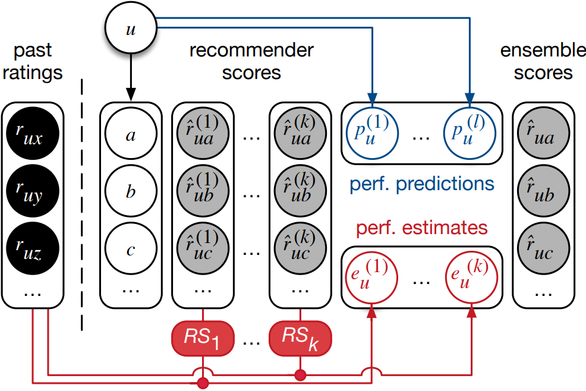

# Performance Estimates for Recommendation Ensembles
This repo contains the source code to reproduce the experiments from the RecSys'20 paper *"Exploiting Performance Estimates for Augmenting RecommendationEnsembles"*. We propose a simple approach to calculate features to substitute peformance predictors. They are called Performance Estimates (PE) and are the historical error of base recommenders for each user. We use them together with base recommender scores in different ensembles to test our research questions.

<p align="center">

</p>

## Setup
Use the file setup.sh. It will run the following commands

```
mkdir data
cd data
wget http://files.grouplens.org/datasets/movielens/ml-1m.zip
unzip ml-1m.zip

cd ../
python3 -m venv env; source env/bin/activate
pip install -r requirements.txt
```

Also download [RankLib-2.8.jar](https://sourceforge.net/projects/lemur/files/lemur/RankLib-2.8/) into experiment3.

## Reproducing the experiments
Use the file experiment2/run_experiment.sh. It will create the folders and run all necessary scripts in sequence:

```
for DATASET in "ml1m"
do
	echo "Running experiments for ${DATASET}"
	echo "	time_based_split"
	python time_based_split.py -d $DATASET 
	echo "	create_hypothesis_dataset"
	python create_hypothesis_dataset.py -d $DATASET 
	echo "	h2_ensemble"
	python h2_ensemble.py -d $DATASET 

	cd ../experiment3/ 
	echo "	learn_to_rank"
	python learn_to_rank.py -d $DATASET
	echo "	borda_count"
	python borda_count.py -d $DATASET

	cd ../experiment2/ 
	echo "	evaluate_ensemble"
	python evaluate_ensembles.py -d $DATASET
done

```

For running the pipeline with other datasets the steps are the same: download them, add to ./data and run experiment2/run_experiment.sh.

Reference
```
@inproceedings{10.1145/3383313.3412264,
	author = {Penha, Gustavo and Santos, Rodrygo L. T.},
	title = {Exploiting Performance Estimates for Augmenting Recommendation Ensembles},
	year = {2020},
	isbn = {9781450375832},
	publisher = {Association for Computing Machinery},
	address = {New York, NY, USA},
	url = {https://doi.org/10.1145/3383313.3412264},
	doi = {10.1145/3383313.3412264},
	booktitle = {Fourteenth ACM Conference on Recommender Systems},
	pages = {111–119},
	numpages = {9},
	keywords = {Performance Prediction, Recommender Systems, Ensembling, Learning to Rank, Performance Estimation},
	location = {Virtual Event, Brazil},
	series = {RecSys '20}
}
```
